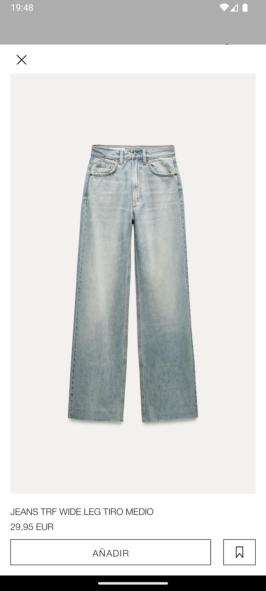
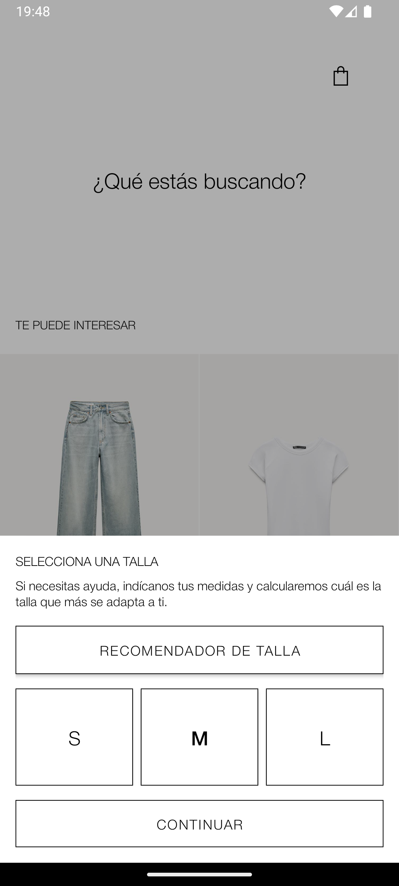
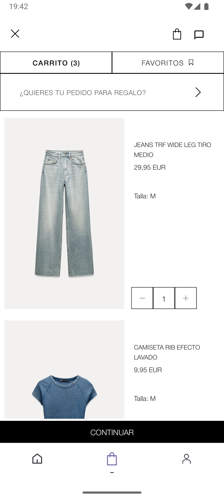
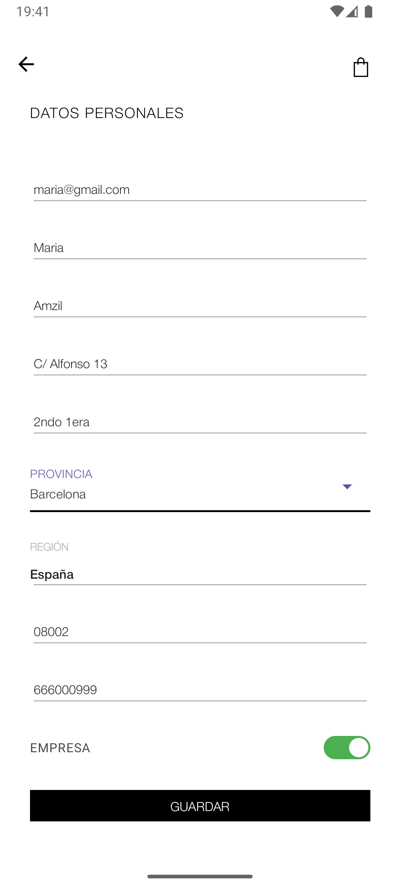
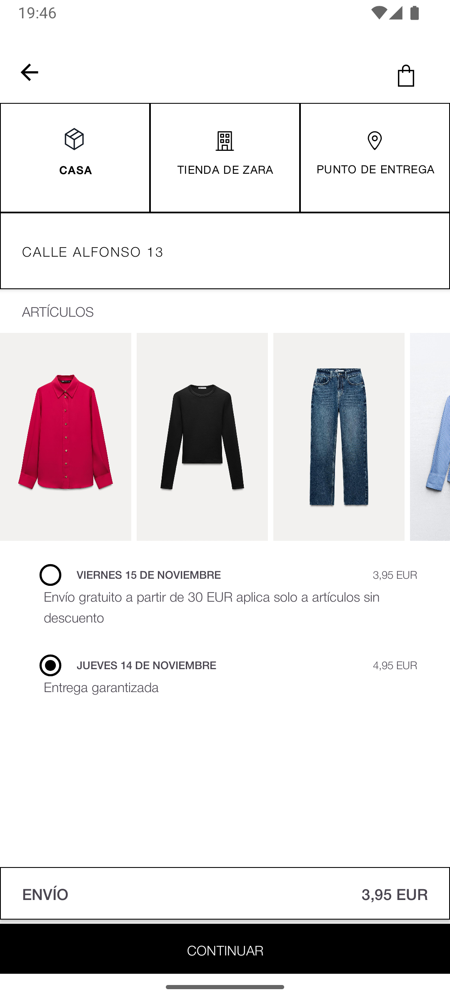
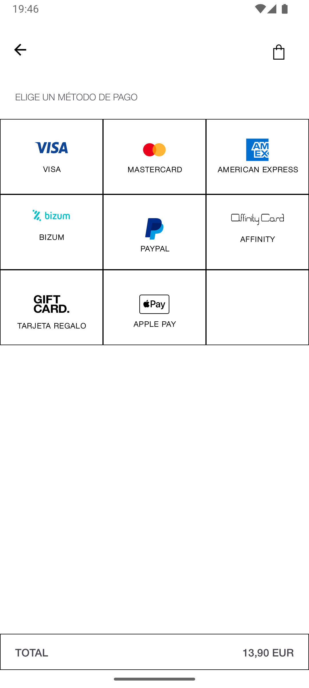
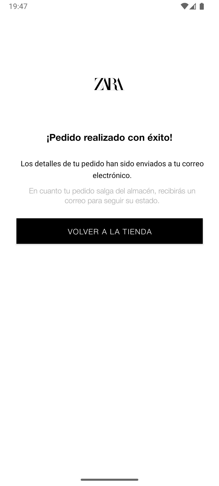

# Zara Funnel
This is a Java-based project developed to practice UI development for Android apps. In this project, I attempted to replicate the Zara app while fulfilling the assignment requirement of recreating a funnel.

---
## 📸 Screenshots

Here are the screenshots of the application's main screens:

### Dashboard

### Product Detail Bottom Sheet

### Size Detail Bottom Sheet

### Shopping Cart Screen

### Register Screen

### Shipping Info Screen

### Payment Cart Screen

### Confirmation Screen
