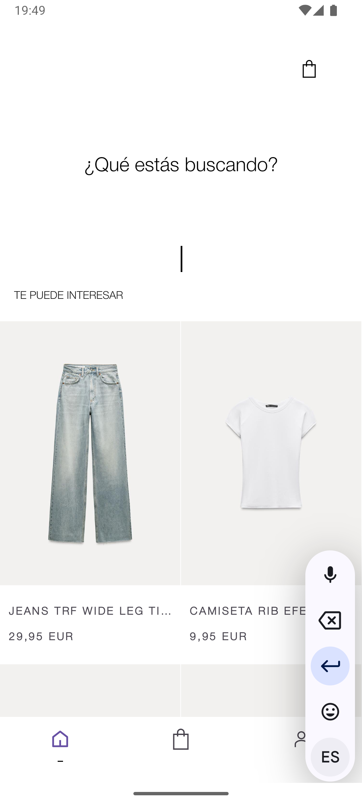

# Zara Funnel
This is a Java-based project developed to practice UI development for Android apps. In this project, I attempted to replicate the Zara app while fulfilling the assignment requirement of recreating a funnel.

---

## 📸 Screenshots

Here are the screenshots of the application's main screens:

### 🧭 Dashboard & Product Detail

  
  

### 📏 Size Detail & 🛒 Shopping Cart

  
  

### 📝 Register & 🚚 Shipping Info

  
  

### 💳 Payment & ✅ Confirmation

  
  

